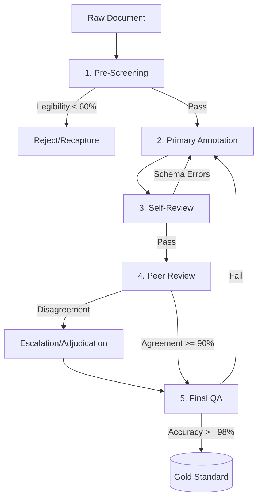

# Deliverable D6: Quality Assurance Workflow Specification

This specification describes the end-to-end process for ensuring annotation quality across the entire 200-document financial corpus. It is designed to be fully implementable for a team of 10 annotators, tracking strict adherence to the project taxonomy and schema validation rules.

---

## 1. Annotation Pipeline Flowchart

The quality assurance pipeline follows a strict five-stage progression.

---

## 2. Role Definitions & Responsibilities

| Role | Responsibilities |
|---|---|
| **Annotator** | Performs initial entity extraction, classification, and metadata tagging. Responsible for Stage 2 (Primary Annotation) and Stage 3 (Self-Review). |
| **Reviewer (Peer)** | Conducts independent checks on a sampled subset of the Annotator's work (Stage 4). Does not alter the original annotations but flags disagreements. |
| **Adjudicator** | Resolves conflicting annotations between the Annotator and Reviewer. Acts as the first point of escalation for guideline ambiguities. |
| **QA Lead** | Manages the sampling queues, monitors inter-annotator agreement metrics, runs the final QA pass (Stage 5), updates schemas/guidelines, and promotes data to the Gold Standard. |

---

## 3. Quality Gates (The 5-Stage Pipeline)

Every document must pass through these quality gates:

| Stage | Actor | Input | Output | Quality Gate (Pass/Fail Criteria) |
|---|---|---|---|---|
| **1. Pre-Screening** | QA Lead | Raw document | Screened document with quality tags | Document legibility $\ge$ 60%; critical pages present. |
| **2. Primary Annotation**| Annotator | Screened document | First-pass annotations | Schema validation passes; all mandatory entity types checked. |
| **3. Self-Review** | Same Annotator | First-pass annotations| Reviewed annotations | Zero schema errors; entity count within expected range. |
| **4. Peer Review** | Reviewer | Reviewed annotations | Adjudicated annotations | Reviewer agreement $\ge$ 90% with annotator on spot-check. |
| **5. Final QA** | QA Lead | Adjudicated annotations| Gold-standard annotations | Random 10% sample achieves 98%+ accuracy. |

---

## 4. Sampling Strategy for Quality Verification

To balance oversight with annotation velocity, the review sampling rate aggressively shifts based on the project's progression:

| Annotation Phase | Review Sampling Rate | Rationale |
|---|---|---|
| **First 30 documents (pilot)** | 100% full review | Calibrate the annotator; identify guideline gaps early. |
| **Documents 31–80** | 50% random sample | Annotator is improving; reduce overhead while maintaining quality. |
| **Documents 81–140** | 30% random sample | Annotator is consistent; focus review on flagged documents. |
| **Documents 141–200** | 20% random + 100% flagged | Annotator is proficient; minimal oversight with targeted review. |
| **Final QA pass** | 10% stratified random sample | Verify overall quality; sample proportional to document categories. |

---

## 5. Escalation Procedures

Disagreements and systemic issues follow a strict escalation path with predefined Service Level Agreements (SLAs):

| Issue Type | Severity | Escalation Path | Resolution SLA |
|---|---|---|---|
| **Schema doesn't accommodate entity**| High | Annotator $\rightarrow$ QA Lead $\rightarrow$ Schema Designer | 4 hours |
| **Guideline ambiguity** | Medium | Annotator $\rightarrow$ Reviewer $\rightarrow$ Guideline Author | 8 hours |
| **Inter-annotator disagreement** | Medium | Annotator $\rightarrow$ Peer $\rightarrow$ Adjudicator | 12 hours |
| **Document quality below threshold** | Low | Annotator $\rightarrow$ QA Lead (exclude or OCR-correct) | 24 hours |
| **Systematic annotation error discovered**| Critical | QA Lead $\rightarrow$ Re-annotate all affected documents | 48 hours |

---

## 6. Feedback Loop Mechanism

The QA pipeline is not purely filtering; it is a mechanism for continuous improvement:
1. **Error Aggregation**: The QA Lead compiles all resolved disagreements and escalation outcomes weekly.
2. **Taxonomy Update**: If an error was caused by a missing definition, the edge case is documented and added to the **Edge Case Taxonomy** (D5).
3. **Guideline Publication**: The **Annotation Guideline** (D2) is version-bumped with new examples.
4. **Annotator Retraining**: Annotators who fail the Stage 4 Peer Review gate on >10% of their batch must review the updated guidelines before receiving new documents.

---

## 7. Tooling Requirements

To support this workflow, the following tools must be configured:

### Label Studio Configuration
- **Review Mode**: Enable reviewer assignment for all completed annotations.
- **Agreement Metrics**: Enable built-in agreement tracking between annotators.
- **Annotation History**: Retain all versions of annotations for audit trail and rollback.
- **Webhook Notifications**: Set up notification for review completion.
- **Data Export Format**: Configure default export to JSON format matching the schema (D1).

### External Tooling
- **Metrics Dashboard**: Connected to Label Studio APIs to track *Time-to-Annotate*, *Entities per Hour*, and *Reviewer Agreement*.
- **Review Queue Management**: Scripted logic to automatically push 50%, 30%, or 20% of completed documents into a specific Reviewer's queue based on the current Sampling Strategy tier.
